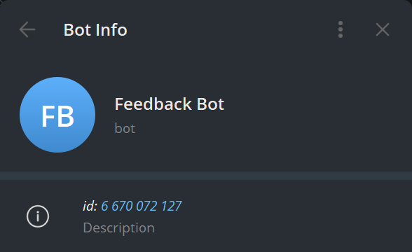
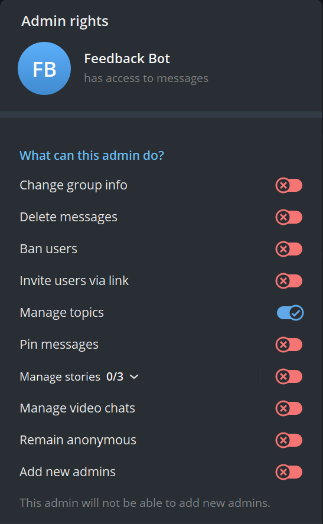

# Feedback Bot

[](https://github.com/ruitunion-org/feedback-bot/actions/workflows/build.yml) 

A free and open-source Telegram Bot that allows you to anonymously chat with multiple users in one Telegram Chat.

When a new user interacts with the Feedback Bot by sending a message, the bot forwards the message to a specific topic dedicated to that user within the Feedback Chat. If a topic for the user does not already exist, the bot creates a new one. This ensures that each user's message is organized in its own topic, allowing for clear and efficient interaction.

Created and supported by [Russian IT Union](https://ruitunion.org/en/about/).

## 📝 Prerequisites

1. Telegram Bot Token;
2. Telegram Chat ID;
3. PostgreSQL connection string.

## 🛠️ Prepare the Environment

### Telegram bot

1. Create a bot with [@BotFather](https://t.me/BotFather);
2. After successfully creating the bot, you will receive a **Telegram Bot Token**;
3. Get the **Telegram Bot ID** of the bot.

❗You can get the ID of any user / chat / bot using desktop Telegram client. To do that go to *Settings* / *Advanced* / *Experimental settings* and enable *Show peer ID in Profile*. Now you will be able to see all the IDs.



### Feedback Chat

1. Create a private chat;
2. Enable topics;
3. Get the **Telegram Chat ID**;
4. Add the bot from the previous step and make it Administrator;
5. The only permission required for the bot is to manage topics.



### PostgreSQL

The bot needs only a connection string: `User ID=postgres;Password=123;Host=ruitunion_feedbackbot_database;Port=5432;Database=feedback_bot;`.

## 🚀 Run

### From GitHub Container Registry

1. Specify the required image from the GitHub Container Registry and the environment variables in `docker-compose.yml` file:

    ``` yml
    services:
      ruitunion_feedbackbot:
        container_name: RuItUnion.FeedbackBot
        image: ghcr.io/ruitunion-org/feedback-bot:v0.2.0
        restart: always
      healthcheck:
        test: curl -f http://localhost/health || exit 1 
        interval: 5s
        timeout: 10s
        environment:
          - ConnectionStrings__Postgres=Host=ruitunion_feedbackbot_database;Port=5432;Database=feedback_bot;User ID=postgres;Password=123;
          - ConnectionStrings__Telegram=YOUR_TELEGRAM_BOT_TOKEN
          - AppOptions__FeedbackChatId=YOUR_TELEGRAM_CHAT_ID
          - AppOptions__Start=YOUR_START_MESSAGE
    ```

3. Run the following command:

    ``` sh
    docker compose up -d 
    ```

### From source code

1. Clone this repo.
2. Specify the environment variables in `docker-compose.yml` file:

    ``` yml
    services:
      ruitunion_feedbackbot:
        container_name: RuItUnion.FeedbackBot
        build:
          context: .
          dockerfile: RuItUnion.FeedbackBot/Dockerfile
        restart: always
        healthcheck:
          test: curl -f http://localhost/health || exit 1 
          interval: 5s
          timeout: 10s
        environment:
          - ConnectionStrings__Postgres=Host=ruitunion_feedbackbot_database;Port=5432;Database=feedback_bot;User ID=postgres;Password=123;
          - ConnectionStrings__Telegram=YOUR_TELEGRAM_BOT_TOKEN
          - AppOptions__FeedbackChatId=YOUR_TELEGRAM_CHAT_ID
          - AppOptions__Start=YOUR_START_MESSAGE
    ```

3. Run the following commands:

    ``` sh
    docker build -t feedback_bot .
    docker compose up -d 
    ```

## 🌟 Features

### Commands

- `/start` - Starts the bot and displays a welcome message.
- `/help` - Displays a list of all commands with their descriptions.
- `/delete` - Removes a reply in the user chat.
- `/open` - Opens a topic in the feedback chat.
- `/close` - Closes a topic in the feedback chat.
- `/ban` - Bans the user.
- `/unban` - Unbans the user.

### Permissions

| Command   | Bot User | Chat User | Chat Admin |
| --------- | -------- | --------- | ---------- |
| `/help`   | ✅        | ✅         | ✅          |
| `/start`  | ✅        | ✅         | ✅          |
| `/delete` | ❌        | ✅         | ✅          |
| `/open`   | ❌        | ❌         | ✅          |
| `/close`  | ❌        | ❌         | ✅          |
| `/ban`    | ❌        | ❌         | ✅          |
| `/unban`  | ❌        | ❌         | ✅          |

## 🤝 Contributing

Contributions are welcome. Here are some ways you can help:

1. **Report bugs**: If you find a bug, please report it by creating an issue on GitHub;
2. **Request features**: Have an idea for a new feature? Let us know by creating a feature request;
3. **Submit pull requests**: If you'd like to fix a bug or add a feature, feel free to fork the repository and submit a pull request.
